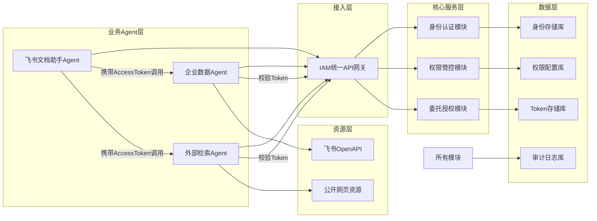

# Agent身份与权限系统开发文档

## 一、系统整体架构设计

### 1.1 分层架构设计



### 1.2 核心交互流程

#### 1.2.1 正常委托调用流程（User → DocAgent → DataAgent → 飞书资源）

1. 用户向飞书文档助手Agent发出请求："帮我生成一季度销售数据报告"
2. DocAgent向IAM系统申请AccessToken，携带委托权限：`{"doc": ["write"], "indata": ["read"]}`
3. IAM系统校验DocAgent身份合法，计算有效权限（DocAgent自身权限 ∩ 申请权限 ∩ 用户权限），签发AccessToken
4. DocAgent携带AccessToken直接调用企业数据Agent的"查询多维表格数据"接口
5. DataAgent收到请求后，调用IAM系统的`verify-token`接口校验AccessToken合法性、权限范围、信任链完整性
6. 校验通过后，DataAgent通过飞书OpenAPI读取多维表格数据，返回结果给DocAgent
7. DocAgent整合数据生成报告，调用飞书API写入文档
8. 全流程所有操作都写入审计日志

#### 1.2.2 越权拦截流程（SearchAgent → DataAgent）

1. 外部检索Agent尝试调用企业数据Agent的接口查询内部数据，携带自己的AccessToken
2. DataAgent收到请求后，调用IAM系统的`verify-token`接口校验权限
3. IAM系统校验发现SearchAgent没有`indata`相关权限，返回403权限不足
4. DataAgent直接返回403错误给SearchAgent，同时IAM记录拦截审计日志
5. 请求不会执行数据查询操作

## 二、核心数据结构设计

### 2.1 AccessToken 结构（JWT格式）

采用标准JWT实现，包含以下字段：

```json
{
  "iss": "IAM-System",
  "AgentID": "AgentID",
  "iat": 1745800000,
  "exp": 1745803600,
  "jti": "唯一TokenID",
  "delegated_chain": [
    {"agent_id": "UserID","jti":"tokenID","scope": {"doc": ["read", "write"], "indata": ["read_bitable"]}},
    {"agent_id": "DocAgent","jti":"tokenID", "scope": {"doc": ["write"], "indata": ["read_bitable"]}}
  ],
  "scope": {
    "doc": ["write"],
    "indata": ["read_bitable"],
    "online": []
  },
  "ip": "127.0.0.1",
  "purpose": "生成一季度销售报告"
}
```

字段说明：

- `delegated_chain`：信任链，按调用顺序排列，最上层是原始用户，下层权限不能超出上层权限
- `scope`：当前Token的有效权限集合，是所有上层权限的交集
- `ip`：绑定请求IP，IP变化则Token失效
- `exp`：Token过期时间，最长不超过24小时

### 2.2 scope 权限声明结构

采用"资源类型:操作列表"的键值对结构：

```json
{
  "doc": ["read", "write", "delete"],
  "indata": ["read_contact", "read_calendar", "read_bitable"],
  "online": ["web_search","fetch_content","analyze_content"],
  "iam": ["apply_token", "verify_token"]
}
```

预定义资源类型：

- `doc`：飞书文档操作权限
- `indata`：企业内部数据访问权限
- `online`：外部网络访问权限
- `iam`：IAM系统自身操作权限

### 2.3 审计日志结构

三类日志统一字段：

| 字段名         | 类型     | 说明                              |
| ----------- | ------ | ------------------------------- |
| `log_id`    | string | 唯一日志ID                          |
| `timestamp` | int64  | 时间戳（毫秒）                         |
| `agent_id`  | string | 操作主体AgentID                     |
| `ip`        | string | 操作IP地址                          |
| `operation` | string | 操作类型（register/authorize/verify） |
| `status`    | string | 操作结果（success/fail/blocked）      |
| `detail`    | object | 操作详情                            |

#### 2.3.1 身份注册日志详情

```json
{
  "subtype": "user/bot/visitor",
  "scope": {"doc": ["read"]},
  "agent_secret": "掩码后的密钥"
}
```

#### 2.3.2 委托授权日志详情

```json
{
  "token_id": "jti字段值",
  "applied_scope": {"doc": ["write"]},
  "granted_scope": {"doc": ["write"]},
  "expire_at": 1745803600,
  "fail_reason": "权限不足"
}
```

#### 2.3.3 权限校验日志详情

```json
{
  "token_id": "jti字段值",
  "required_scope": {"indata": ["read"]},
  "valid": true,
  "fail_reason": "无indata权限"
}
```

## 三、IAM系统API接口规范

所有接口统一前缀：`http://localhost:9000/IAMsystem`
统一响应格式：

```json
{
  "code": 200,
  "message": "success",
  "data": {}
}
```

统一错误码：

- 200：成功
- 400：请求参数错误
- 401：身份验证失败
- 403：权限不足
- 404：资源不存在
- 500：服务器内部错误

***

### 3.1 身份注册模块API

#### 3.1.1 用户/访客注册

**接口地址**：`POST /identity/register/user`
**请求参数**：

```json
{
  "Agent_name": "Agent的名字",
  "subtype": "user/visitor",
  "scope": {"doc": ["read"], "online": ["web_search"]},
  "ip": "请求IP地址"
}
```

**响应数据**：

```json
{
  "Agent_name":"请求的Agent_name",
  "subtype":"user/visitor",
  "scope":"身份权限和请求权限的交集",
  "agent_id": "MyAgent(系统生成的唯一标识)",
  "agent_secret": "32位随机密钥",
  "registered_at": 1745800000
}
```

#### 3.1.2 机器Agent注册

**接口地址**：`POST /identity/register/bot`
**请求参数**：

```json
{
  "Bot_name":"bot的名字",
  "Bot_id": "唯一BotID(系统唯一生成)",
  "scope": {"indata": ["read_contact", "read_calendar", "read_bitable"]},
  "ip": "请求IP地址",
  "sub_scope":{"user":scope结构,"visitor":scope结构} //身份权限对应表 
}
```

**响应数据**：同上，返回agent\_secret

#### 3.1.3 身份校验

**接口地址**：`POST /identity/verify`
**请求参数**：`{"agent_id": "", "agent_secret": ""}`
**响应数据**：`{"valid": true, "scope": {}}`

***

### 3.2 委托授权模块API

#### 3.2.1 申请AccessToken

**接口地址**：`POST /auth/apply-token`
**请求参数**：

```json
{
  "agent_id": "",
  "agent_secret": "",
  "delegated_chain": [],
  "applied_scope": {"doc": ["write"], "indata": ["read"]},
  "purpose": "生成销售报告",
  "ttl": 3600(使用时间)
}
```

**响应数据**：

```json
{
  "access_token": "JWT字符串",
  "expire_at": 1745803600,
  "granted_scope": {}
}
```

#### 3.2.2 校验AccessToken

**接口地址**：`POST /auth/verify-token`
**请求参数**：

```JSON
{
    "access_token": "", 
    "required_scope": {"indata": ["read"]}
}
```

```JSON
{
    "valid": true, 
    "scope": {}
}
```

#### 3.2.3 撤销AccessToken

**接口地址**：`POST /auth/revoke-token`
**请求参数**：`{"agent_id": "", "agent_secret": "", "token_id": ""}`
**响应数据**：`{"revoked": true}`

***

### 3.3 审计查询模块API

#### 3.3.1 审计操作是否合法

**接口地址**：POST` /audit/logs`
**请求参数**：

```JSON
{
"agent_id": "使用者id", 
"start_time": "开始时间戳", 
"end_time": "结束时间戳", 
"operation": "操作的类型 register/authorize/verify", 
"detail":"操作详情，类型是一个object，包括2.3.1-2.3.3"
}

```

**响应数据**：

```JSON
{
    "vaild":"true/false",
    "fail_reason":"失败原因 （ip多次请求注册token/相同agent_name多次注册/短时间内异地申请"
}
```

## 四、核心模块开发细节

### 4.1 身份认证模块

**开发内容**：

1. 实现用户/访客/Bot三类身份的注册逻辑，保证AgentID全局唯一
2. 生成32位随机AgentSecret
3. 实现身份校验接口，验证AgentID和AgentSecret的合法性
4. 存储所有身份的静态权限配置

**核心逻辑**：

- 注册时检查AgentID是否已存在，重复则返回错误
- 注册时自动写入存储文件

### 4.2 权限管控模块

**开发内容**：

1. 实现权限集合的交集计算逻辑（用户权限 ∩ Agent权限 ∩ 申请权限）
2. 实现权限校验逻辑，判断当前Token是否满足所需权限
3. 支持静态权限（注册时配置）和动态权限（运行时计算）的合并

**核心逻辑**：

- 权限校验采用最小权限原则，取所有上层权限的交集
- 空列表代表没有该资源的任何权限，`["all"]`代表拥有该资源的所有权限

### 4.3 委托授权模块

**开发内容**：

1. 实现JWT Token的签发、验证、解析逻辑
2. 实现信任链校验逻辑，下层权限不能超出上层权限
3. 实现Token过期自动失效、IP绑定校验
4. 实现Token撤销功能，支持黑名单机制

**核心逻辑**：

- 签发Token前必须校验委托链的合法性，逐层验证权限
- Token中必须包含完整的委托链，保证可追溯
- 撤销的Token加入黑名单，校验时优先检查黑名单

### 4.4 审计追溯模块

**开发内容**：

1. 实现异常行为检测（短时间多次失败请求、越权尝试等）
2. 支持日志导出功能

**核心逻辑**：

- 审计API传入的操作是否合法（实时审计）
- 每隔 1h 检查新的 日志，查看是否有问题（主要是审计整个agent委托链是否有缺漏，将有问题的agentID的用户或机器拉入黑名单,将user表中对应的status设置为disable，禁止其所有操作）

## 五、业务Agent开发规范与接入要求

### 5.1 通用接入规范

所有Agent必须遵循以下要求：

1. 实现统一的API调用格式：接收JSON参数，返回JSON响应
2. 所有对外接口必须校验请求头中的`Authorization: Bearer {access_token}`
3. 校验Token必须调用IAM系统的`/auth/verify-token`接口，禁止本地校验
4. 实现健康检查接口：`GET /health`，返回200表示正常运行
5. 错误响应必须包含code、message字段

***

### 5.2 飞书文档助手Agent（DocAgent）

**职责**：接收用户请求，协调其他Agent完成数据收集，生成报告并写入飞书文档
**静态权限配置**：

```json
{
  "doc": ["read", "write"],
  "indata": ["read"],
  "online": ["web_search"],
  "iam": ["apply_token"]
}
```

**需要实现的功能**：

1. 自然语言理解用户需求，拆解为子任务
2. 调用IAM接口申请对应权限的AccessToken
3. 携带AccessToken调用企业数据Agent/外部检索Agent获取所需数据
4. 整合数据生成结构化报告，调用飞书API写入文档
5. 返回最终结果给用户

***

### 5.3 企业数据Agent（DataAgent）

**职责**：唯一有权访问企业内部飞书资源的Agent，提供内部数据查询能力
**静态权限配置**：

```json
{
  "indata": ["read_contact", "read_calendar", "read_bitable"],
  "iam": ["verify_token"]
}
```

**需要实现的API接口**：

1. `POST /api/read_bitable`：读取多维表格数据，参数：`table_id`, `fields`, `filter`
2. `POST /api/read_contact`：查询通讯录信息，参数：`user_id`, `department_id`
3. `POST /api/read_calendar`：查询日程信息，参数：`start_time`, `end_time`, `user_id`

**安全要求**：

- 所有接口必须先校验AccessToken的`indata`相关权限
- 禁止修改、删除任何飞书资源，只提供只读能力
- 敏感数据返回前做脱敏处理

***

### 5.4 外部检索Agent（SearchAgent）

**职责**：提供公开网页信息检索能力，禁止访问任何内部资源
**静态权限配置**：

```json
{
  "online": ["web_search"],
  "iam": ["verify_token"]
}
```

**需要实现的API接口**：

1. `POST /api/web_search`：网页搜索，参数：`query`, `num_results`
2. `POST /api/web_crawl`：指定网页内容抓取，参数：`url`

**安全要求**：

- 所有接口必须先校验AccessToken的`online`相关权限
- 禁止访问内网IP地址，所有请求必须走公网
- 屏蔽敏感内容检索
- 禁止调用任何内部系统接口

## 其他相关

1. 日志写在

## 六、测试用例、部署指南与验收标准

### 6.1 核心测试用例

#### 6.1.1 正常流程测试用例

| 测试场景      | 操作步骤                                                        | 预期结果                    |
| --------- | ----------------------------------------------------------- | ----------------------- |
| Agent注册   | 调用注册接口注册DocAgent、DataAgent、SearchAgent                      | 注册成功，返回AgentSecret      |
| 正常委托调用    | DocAgent申请包含indata:read权限的Token，调用DataAgent的read\_bitable接口 | 调用成功，返回多维表格数据，审计日志有完整记录 |
| Token权限校验 | 使用仅拥有doc权限的Token调用DataAgent接口                               | 返回403权限不足，审计日志记录拦截信息    |
| 信任链校验     | DocAgent申请超出自身权限的Token                                      | 申请被拒绝，返回权限不足            |
| IP绑定校验    | 使用绑定了127.0.0.1的Token从其他IP调用                                 | Token失效，返回401           |

#### 6.1.2 异常场景测试用例

| 测试场景    | 操作步骤                        | 预期结果                   |
| ------- | --------------------------- | ---------------------- |
| 越权访问    | SearchAgent尝试调用DataAgent的接口 | 请求被拦截，返回403，审计日志记录拦截信息 |
| Token过期 | 使用过期的Token调用接口              | 返回401，提示Token过期        |
| 伪造Token | 使用伪造的JWT Token调用接口          | 返回401，验证失败             |
| 权限提升    | 申请超出上层委托权限的Token            | 申请被拒绝，返回权限不足           |

### 6.3 验收标准

#### 最低达标要求（必须通过）

1. 系统架构图、AccessToken字段说明、审计日志字段说明文档完整
2. 三个Agent可以完成一次正常协作：DocAgent调用DataAgent获取数据生成报告
3. 实现身份认证和Agent静态授权
4. 具备审计追溯能力，所有操作都有日志记录
5. 越权访问可以被正确拦截，返回错误码并记录日志

#### 优秀加分项

1. 实现动态授权和Token实时撤销机制
2. 支持Token盗用检测（IP变化自动失效）
3. 提供可视化界面展示调用链路和审计日志
4. 集成AI异常检测，识别prompt注入等攻击
5. 支持异构Agent快速接入

