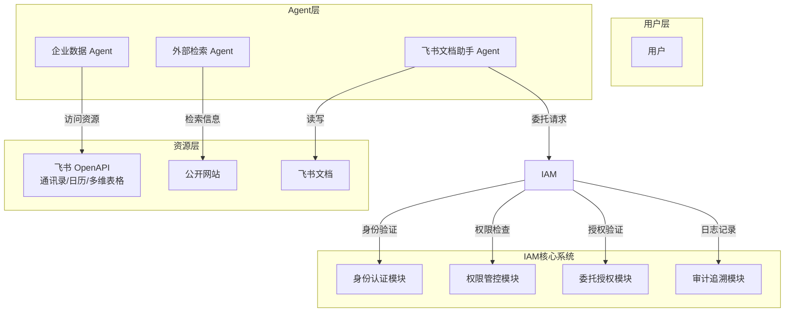
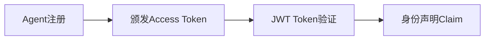
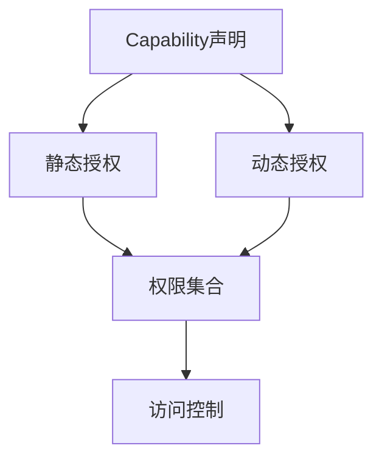
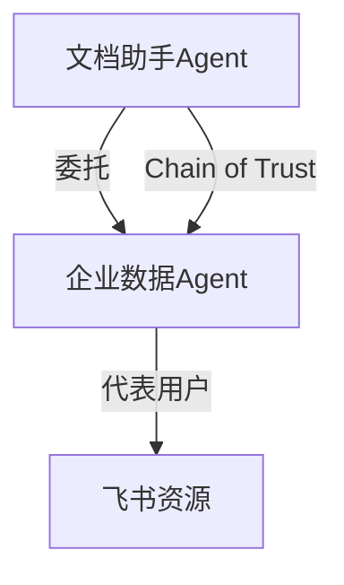
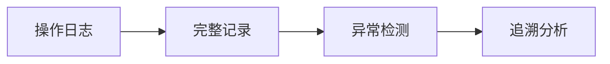
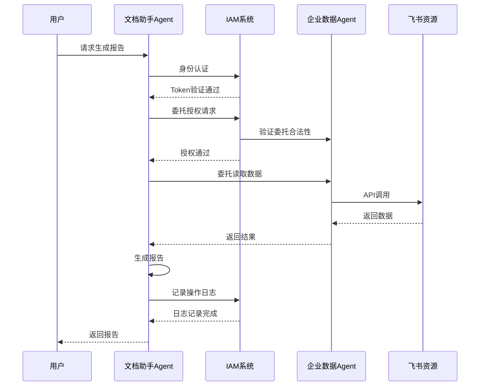
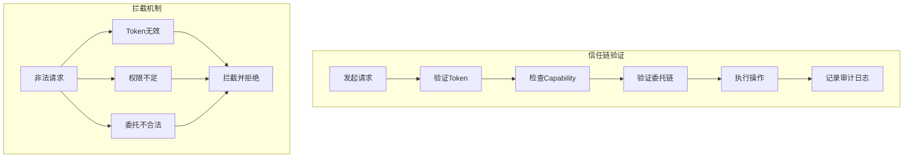

# Agent 身份与权限系统架构图

## 系统整体架构

```mermaid
graph TB
    subgraph 用户层
        User[用户]
    end

    subgraph Agent层
        DocAgent[飞书文档助手 Agent]
        DataAgent[企业数据 Agent]
        SearchAgent[外部检索 Agent]
    end

    subgraph IAM核心系统
        Auth[身份认证模块]
        Perm[权限管控模块]
        Deleg[委托授权模块]
        Audit[审计追溯模块]
    end

    subgraph 资源层
        FeishuAPI[飞书 OpenAPI<br/>通讯录/日历/多维表格]
        PublicWeb[公开网站]
        Docs[飞书文档]
    end

    DocAgent -->|委托请求| IAM
    DataAgent -->|访问资源| FeishuAPI
    SearchAgent -->|检索信息| PublicWeb
    IAM -->|身份验证| Auth
    IAM -->|权限检查| Perm
    IAM -->|授权验证| Deleg
    IAM -->|日志记录| Audit
    DocAgent -->|读写| Docs
```

## 核心模块详细设计

### 1. 身份认证模块 (Authentication)

```mermaid
graph LR
    A[Agent注册] --> B[颁发Access Token]
    B --> C[JWT Token验证]
    C --> D[身份声明Claim]
```

### 2. 权限管控模块 (Authorization)

```mermaid
graph TB
    A[Capability声明] --> B[静态授权]
    A --> C[动态授权]
    B --> D[权限集合]
    C --> D
    D --> E[访问控制]
```

### 3. 委托授权模块 (Delegation)

```mermaid
graph TB
    A[文档助手Agent] -->|委托| B[企业数据Agent]
    B -->|代表用户| C[飞书资源]
    A -->|Chain of Trust| B
```

### 4. 审计追溯模块 (Audit)

```mermaid
graph LR
    A[操作日志] --> B[完整记录]
    B --> C[异常检测]
    C --> D[追溯分析]
```

## 数据流向图

```mermaid
sequenceDiagram
    participant User as 用户
    participant Doc as 文档助手Agent
    participant IAM as IAM系统
    participant Data as 企业数据Agent
    participant Feishu as 飞书资源

    User->>Doc: 请求生成报告
    Doc->>IAM: 身份认证
    IAM-->>Doc: Token验证通过
    Doc->>IAM: 委托授权请求
    IAM->>Data: 验证委托合法性
    IAM-->>Doc: 授权通过
    Doc->>Data: 委托读取数据
    Data->>Feishu: API调用
    Feishu-->>Data: 返回数据
    Data-->>Doc: 返回结果
    Doc->>Doc: 生成报告
    Doc->>IAM: 记录操作日志
    IAM-->>Doc: 日志记录完成
    Doc-->>User: 返回报告
```

## 安全机制图

```mermaid
graph TB
    subgraph 信任链验证
        A[发起请求] --> B[验证Token]
        B --> C[检查Capability]
        C --> D[验证委托链]
        D --> E[执行操作]
        E --> F[记录审计日志]
    end

    subgraph 拦截机制
        G[非法请求] --> H[Token无效]
        H --> I[拦截并拒绝]
        G --> J[权限不足]
        J --> I
        G --> K[委托不合法]
        K --> I
    end
```
